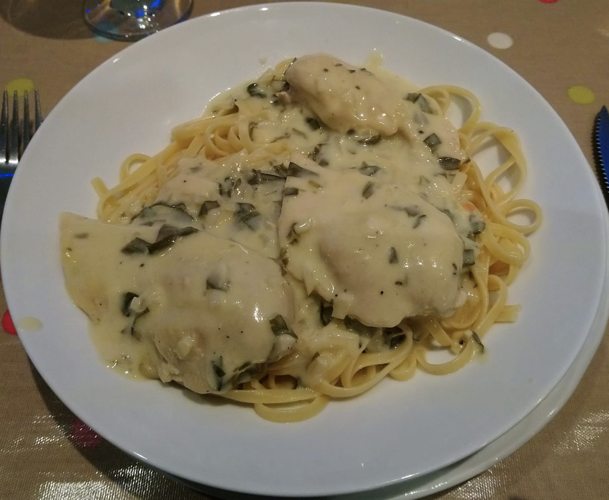

# Chicken Tarragon with Tagliatelle

## Ingredients

Serves 3-4 people

| Amount        | Item                                      |
| ------------- | ----------------------------------------- |
| 250-350g      | tagliatelle                               |
| 3-4           | chicken breasts                           |
| 2-3           | shallots                                  |
| 2 cloves      | garlic                                    |
| 300ml         | chicken stock (1 cube / stock pot)        |
| 150ml         | double cream                              |
| 150ml         | wine                                      |
| large handful | fresh or dried tarragon (fresh is better) |
|               | olive oil                                 |
|               | salt                                      |
|               | pepper                                    |

## Instructions

1. Dice the shallots and garlic, prepare the chicken stock

2. Trim the breasts. Cut them to size (about 2-3 long slices per breast), however you want to eat them on the plate.

3. Heat a large saucepan on medium-high heat with 2 tbsp olive oil. Sear the breasts: just make sure it's golden brown on all sides. Some water may come out of the breasts and they may reduce in size during cooking. Add plenty of salt and pepper to the meat after it has cooked for a few minutes. One seared, transfer the meat to a small plate.

4. Reduce the heat to medium and add another tbsp of olive oil. Add the shallots and garlic and cook for 2 minutes.

5. Add the wine and bring to a simmmer to allow some of the alcohol to cook off.

6. Add about half of the chicken stock, the double cream, most of the tarragon and a some pepper. Continue to simmer for about a minute or so.

7. Add the chicken pieces to the sauce. Make sure there is enough liquid to cover the tops of the chicken, add more wine, cream etc. if needed. Add a lid to the top of the pan and simmer for 10 minutes. Make sure the sauce doens't evaporate or thicken too quickly.

8. Bring a seperate pot of water to boil, generously salted. Add the pasta and cook as per package instructions.

9. Season the sauce with salt to taste. Check the temperature of the chicken with a thermometer, or skewer the chicken and make sure the juices run clear.

10. Serve with remaining tarragon or chopped parsley on top.
