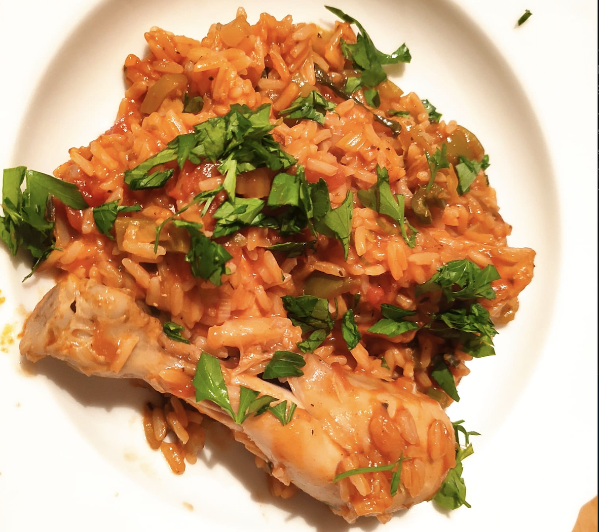

# Jambalaya

## Ingredients

Serves 4-6 people

| Amount      | Item                            |
| ----------- | ------------------------------- |
| 700g        | chicken (thighs pref.)          |
| 2/3         | chorizo (full sausage)          |
| 2 med       | onion                           |
| 2 sticks    | celery                          |
| 1 large     | pepper                          |
| 6-8 cloves  | garlic                          |
| 90g         | tomato puree                    |
| 1 can       | chopped tomatoes                |
| 1 litre     | chicken stock                   |
| 400g        | rice                            |
| 1 + 1/2 tsp | salt                            |
| 1 tsp       | black pepper                    |
| 1 tsp       | thyme                           |
| 1 tsp       | basil                           |
|             | olive oil                       |
|             | cayenne pepper                  |
|             | fresh parsley                   |
|             | spring onions (optional)        |
|             | worcestershire sauce (optional) |

## Instructions

1. Dice the onion, peppers and celery. Mince the garlic. Slice the chorizo. Optionally, if you want to have bite-sized peices of chicken, cut the meat into 3cm cubes.

2. Add a tablespoon of olive oil to a large pan and bring to medium heat.

3. Add the chorizo. Cook for 2 minutes.

4. Add the chicken peices. Cook for 6-8 minutes.

5. Remove all the meat and keep the oil in the pan. Add another tablespoon of olive oil. Bring up to temperature.

6. Optionally, slice the cooked chorizo into smaller pieces (e.g. quarters). This makes the chorizo more evenly distributed at the end. If you prefer to eat bigger chorizo peices, ignore this step.

7. Add the onions, celery and peppers. Cook for 6-8 minutes.

8. Add the meat back to the pan, along with the tomato puree, chopped tomato & worcestershire sauce. Stir well and add about a teaspoon of salt.

9. Add the chicken stock. Bring to boil and reduce to simmer.

10. Add the rice. Optionally, add spring onions.

11. Add the thyme, basil, cayenne pepper and black pepper.

12. Cover and cook for 30 minutes. Give it a stir after 25 minutes. Chop some parsley.

13. Serve with parsley. Enjoy!
