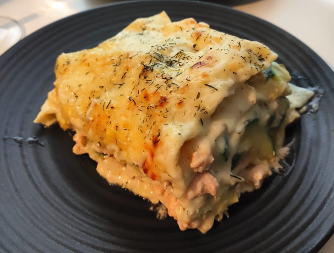

# Salmon and Leek Lasagna

## Ingredients

Serves 3-4 people

| Amount  | Item            |
| ------- | --------------- |
| 750g    | salmon          |
| 2-3     | leeks           |
| 1       | courgette       |
| 1 litre | whole milk      |
| 110g    | butter          |
| 80g     | emmental cheese |
| 80g     | plain flour     |
| 9-12    | lasagna sheets  |
|         | olive oil       |
|         | salt            |
|         | black pepper    |
|         | nutmeg          |
|         | dill            |

## Instructions

1. Thorougly wash and chop the leeks and courgette into 1/2cm slices. Ensure salmon is defrosted and cleaned. Crumble the salmon into small pieces, ensuring there are no bones. Grate the cheese.

2. Preheat the oven to 200C.

3. Begin to lighly fry the leeks for 10-12 minutes in a covered pan with 2 tablespoons of olive oil and 30g of butter. After 8 minutes, add the salmon flakes to partially cook them. Add about a half teaspoon of dill.

4. Melt 70g of butter in a large saucepan on low heat. Gradually add flour, toasting it and stirring constantly. Add the milk gradually (optionally heat it first with salt). Beat and stir until it is all integrated and the flour lumps are dissolved.

5. Cook for 6-8 minutes. Season the bechamel with a salt, pepper and a _light_ (!) shaving of nutmeg to taste.

6. Line a large ovenproof dish with baking paper (or coat with olive oil) and put down 1 layer of lasagna sheets. Add a little bechamel source (make sure the corners are covered!), then some leek/salmon mix and a light sprinkle of grated cheese.

7. Repeat this process 2-3 more times and make sure the last layer is lasagna sheets, a little bechamel and the rest of the cheese. Sprinkle some dill as a garnish before or after cooking.

8. Cook for 20 minutes. Enjoy :)
